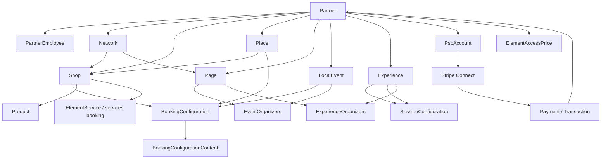
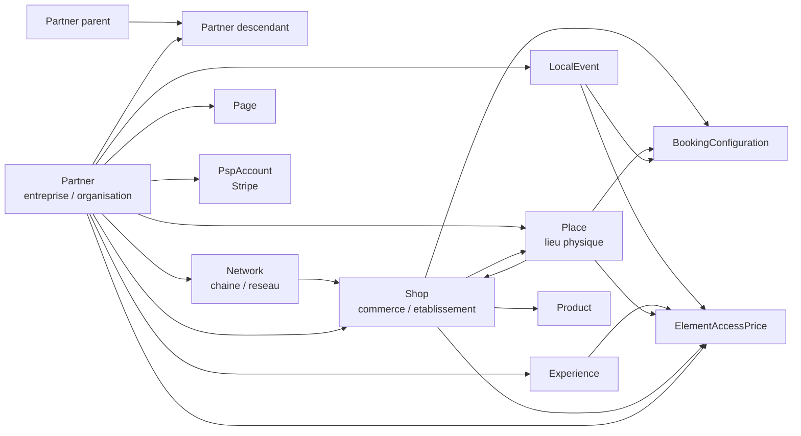

# Partner context - izilife

> Mise a jour active du 14 aout 2026 : ce document conserve l'inventaire historique du socle. Pour les decisions produit et techniques actuellement applicables, lire `partner-space-decisions-2026-08-14.md` puis `partner-space-roadmap-priorisee.md`. En cas de contradiction, ces deux documents plus recents priment.

Document descriptif de l'etat actuel, base sur:

- `C:/Users/alcamara/Documents/agentic_Workspace/izilife/context/tables.sql`
- `C:/Users/alcamara/Documents/agentic_Workspace/izilife/context/izilife-global.md`
- `C:/Users/alcamara/Documents/agentic_Workspace/izilife/context/Docs/Description izilife chat gpt.pdf`
- BO CodeIgniter: `C:/xampp/htdocs/izilife-admin/app`
- Portail extrait: `C:/xampp/htdocs/izilife-partner-admin/app/app.zip`, analyse en copie locale `work/partner-app`

Ce document ne propose aucune amelioration. Il decrit le fonctionnement existant et les ecarts visibles.

## Definition metier d'un Partner

Un `Partner` est une entite entreprise/organisation rattachee aux objets exploitables d'izilife: lieux, shops, events, experiences, pages et comptes PSP. Le PDF de contexte resume son role ainsi: les partners sont les entites entreprises auxquelles sont rattaches les lieux, events et PSP pour verser de l'argent. Le `Network` est la notion de chaine rattachee a un partner, par exemple McDo/BK, dans laquelle on peut placer des restaurants.

Dans le BO, un Partner est gere comme une fiche administrative:

- identite: `name`, `string_id`, `unique_id`
- donnees legales/contact: `company_ident_number`, `email`, `phone`, adresse, ville, code postal, contact firstname/lastname/number
- classification: `partner_type_id`, et historiquement `PartnerType`
- hierarchie: `parent_id`, avec affichage des partners descendants
- rattachements: shops, networks, pages, events, experiences, PSPAccount
- paiement/onboarding legacy: champs `payout_provider`, `payout_provider_account_id`, `payout_status` utilises par `Partner.php`
- paiement/onboarding actuel: table/model `PspAccount`, utilisee par `PspOnboarding.php` et certaines vues BO

Important: dans `tables.sql`, les tables `Partner`, `PartnerEmployee`, `PartnerType`, `PspAccount`, `Product` et `Transaction` sont referencees ou utilisees par le code mais leur `CREATE TABLE` complet n'apparait pas dans le dump fourni. Les champs listes pour ces tables proviennent donc des usages code.

## Relations SQL visibles dans tables.sql

### PartnerCategory

`PartnerCategory` est un referentiel arborescent de categorisation utilisable pour `Network` et/ou `Partner`.

Champs principaux:

- `id`, `name`, `string_id`
- `is_active`
- `is_usable_for_network`
- `is_usable_for_partner`
- `is_for_place`
- `need_shop_category`
- `need_place_type`
- `parent_id`

Relation:

- `PartnerCategory.parent_id -> PartnerCategory.id`

### Network

`Network` represente une chaine/reseau. Il est rattache a un partner et peut porter une categorie commerce ou type de lieu.

Champs principaux:

- `id`, `name`, `network_string_id`
- `partner_category -> PartnerCategory.id`
- `shopCatagory` (orthographe actuelle dans SQL)
- `place_type`
- `is_with_franchise`
- `partner_id`
- `is_active`
- `parent_id`
- `network_activity_level`: 1 international, 2 national, 3 regional

Relations explicites:

- `Network.parent_id -> Network.id`
- `Network.partner_category -> PartnerCategory.id`

Relations implicites/usees par le code:

- `Network.partner_id -> Partner.id`
- `Network.shopCatagory -> ShopCategory.id`
- `Network.place_type -> PlaceType.id`

### Place

`Place` est le lieu physique geolocalise. Il peut etre rattache a un partner.

Champs Partner-relevants:

- `partner_id`
- `shop_id`
- `in_on_place`
- `is_part_of`
- `place_type`
- `place_access_type`
- `place_booking_needed_for_access`
- `basic_price`, `basic_price_currency`
- `mail`, `phone_number`
- medias: `cover_picture`, `principal_picture`
- SEO/identite: `place_string_id`, `unique_id`

Relations explicites dans le dump:

- `place_access_type -> AccessType.id`
- `place_booking_needed_for_access -> AccessBookingNeeded.id`
- `basic_price_currency -> Currency.id`
- `toilet_accessibility_minimum_buy_currency -> Currency.id`

Relations implicites/usees par code ou schema:

- `Place.partner_id -> Partner.id`
- `Place.place_type -> PlaceType.id`
- `Place.city_id -> City.id`
- `Place.shop_id -> Shop.id`
- `Place.in_on_place -> Place.id`
- `Place.is_part_of -> Place.id`

### Shop

`Shop` est le commerce/etablissement, separation legacy avec `Place`.

Champs Partner/Network-relevants:

- `partner_id`
- `network_id`
- `in_on_place`
- `shopCategory_id`, `secondShopCategory_id`, `thirdShopCategory_id`
- `shop_access_type`
- `shop_booking_needed_for_access`
- `self_delivery`
- `click_delivery_active`
- `click_collect_active`
- `tour_minimum_order`, `self_delivery_minimum_order`, `now_delivery_minimum_order`, `click_collect_minimum_order`
- `have_fidelity_program`
- `mail`, `phone_number`
- `principal_picture`, `principal_cover`
- `qr_code`

Relations explicites dans le dump:

- `shop_access_type -> AccessType.id`
- `shop_booking_needed_for_access -> AccessBookingNeeded.id`
- `basic_price_currency -> Currency.id`
- `toilet_accessibility_minimum_buy_currency -> Currency.id`
- `itinerant_organisation_type -> ItinerantOrganisationType.id`
- `itinerant_vehicule_type -> ItinerantVehiculeType.id`

Relations implicites/usees:

- `Shop.partner_id -> Partner.id`
- `Shop.network_id -> Network.id`
- `Shop.shopCategory_id -> ShopCategory.id`
- `Shop.city_id -> City.id`
- `Shop.in_on_place -> Place.id`

### LocalEvent

`LocalEvent` est l'evenement. Il peut etre organise ou rattache a un partner.

Champs Partner-relevants:

- `partner_id`: organisateur principal possible
- `page_id`, `group_id`, `place_id`, `shop_id`
- `event_place`, `event_shop`
- `use_izilife_paiement`
- `number_of_tickets`
- `event_booking_needed_for_access`
- `event_access_type`
- `access_on_booking`
- `basic_price`, `basic_price_currency`
- `registration_state`

Relations explicites visibles:

- `event_access_type -> AccessType.id`
- `event_booking_needed_for_access -> AccessBookingNeeded.id`
- `basic_price_currency -> Currency.id`
- `time_on_place_measurement_unity_id -> TimeMeasurementUnity.id`
- `recurrence_type -> RecurrenceType.id`
- `representation_id -> Representation.id`
- `principal_activity_category -> ActivityPrincipalCategory.id`

Relations implicites/usees:

- `LocalEvent.partner_id -> Partner.id`
- `LocalEvent.page_id -> Page.id`
- `LocalEvent.event_place/place_id -> Place.id`
- `LocalEvent.event_shop/shop_id -> Shop.id`

### Experience

`Experience` est l'activite/experience. Elle peut etre rattachee a un partner.

Champs Partner-relevants:

- `partner_id`
- `page_id`
- `meet_place`
- `meet_shop`
- `experience_on_event`
- `experience_access_type`
- `access_on_booking`
- `experience_booking_needed_for_access`
- `basic_price`, `basic_price_currency`
- `registration_state`

Relations explicites visibles:

- `experience_access_type -> AccessType.id`
- `experience_booking_needed_for_access -> AccessBookingNeeded.id`
- `basic_price_currency -> Currency.id`
- `principal_activity_category -> ActivityPrincipalCategory.id`
- `duration_measurement_unity_id -> TimeMeasurementUnity.id`

Relations implicites/usees:

- `Experience.partner_id -> Partner.id`
- `Experience.page_id -> Page.id`
- `Experience.meet_place -> Place.id`
- `Experience.meet_shop -> Shop.id`
- `Experience.experience_on_event -> LocalEvent.id`

### EventOrganizers et ExperienceOrganizers

Ces tables ajoutent des organisateurs multiples pour events/experiences.

`EventOrganizers`:

- `event_id -> LocalEvent.id`
- `page_id -> Page.id`
- `partner_id -> Partner.id`
- `place_id -> Place.id`
- `shop_id -> Shop.id`

`ExperienceOrganizers`:

- `experience_id -> Experience.id`
- `page_id -> Page.id`
- `partner_id -> Partner.id`
- `place_id -> Place.id`
- `shop_id -> Shop.id`

### Page

`Page` peut representer directement un partner ou etre administree par un partner.

Champs Partner-relevants:

- `partner_id`: page representant directement un partner
- `property_partner_id`: page possedee/administree par un partner
- `official_network_id`: page officielle d'un network
- `page_category_id`
- `user_id`

Relations explicites:

- `Page.page_category_id -> PageCategory.id`
- `Page.user_id -> User.id`

Relations implicites/usees:

- `Page.partner_id -> Partner.id`
- `Page.property_partner_id -> Partner.id`
- `Page.official_network_id -> Network.id`

### Booking

Le dump contient surtout la configuration de reservation, pas la reservation client finale.

`BookingConfiguration`:

- peut etre lie a `place_id`, `shop_id`, `animation_id`, `equipment_id`, `event_id`
- peut etre specialisee par `shop_category_id` ou `place_type_id`
- gere `is_current`, `is_active`, recurrence temporaire/saisonniere

`BookingConfigurationContent`:

- lie a `booking_conf_id`
- gere repetition, jours, heures, capacite, delai minimum
- gere les "services" de reservation via `have_multi_services` et `have_slots_in_services`

`Booking.php` ajoute/met a jour des slots de service sur `BookingConfigurationContent`, avec limite de 4 services par contenu.

### Session pour Experience

`SessionConfiguration` et `SessionConfigurationContent` jouent le role equivalent pour les experiences:

- `SessionConfiguration.experience_id -> Experience.id`
- `SessionConfigurationContent.session_conf_id -> SessionConfiguration.id`
- `SessionConfigurationContent.experience_id -> Experience.id`
- `SessionConfigurationContent.place_id -> Place.id`

### ElementAccessPrice

`ElementAccessPrice` est le tarif/acces achetable. Il peut etre rattache a plusieurs scopes:

- `place_id`
- `shop_id`
- `event_id`
- `event_serie_id`
- `experience_id`
- `animation_id`
- `equipment_id`
- `programmation_id`
- `partner_id`
- `annual_celebration_id`

Le PDF de contexte precise que les EAP sont les tarifs d'entree a des events, lieux, experiences, achetes avec ou sans reservation.

## PartnerEmployee

`PartnerEmployee` n'a pas son DDL dans `tables.sql`, mais il est central dans le code.

Champs utilises:

- `id`
- `partner_id`
- `login`
- `email`
- `phone_number`
- `password`
- `firstname`
- `lastname`
- `role`
- `status`
- `mfa_enabled`
- `mfa_method`
- `unique_id`

Creation depuis le BO:

- `Partner::postCreatePartner()` peut creer un root employee si `create_root_employee` est coche.
- Le login root est construit sous la forme `root_ident + "." + partner.string_id`.
- Le role cree est `1` (Owner).
- Le statut cree est `active`.
- Un code de validation est cree dans `Validation_model::createUserValidation()`.
- L'email `sendPartnerChoosePasswordValidation()` est envoye pour choisir le mot de passe.

Gestion dans le portail extrait:

- `Employee::getIndex()` liste les employees du partner courant.
- `Employee::postAdd()` ajoute un employe au scope du partner courant.
- Roles autorises a la creation: `3` ou `4`.
- Login construit sous la forme `login_prefix + "." + partner.string_id`.
- Detection de login/email/telephone deja existant via `Employee_model`.
- En cas de contact deja actif, un flux de transfert est lance via validation `partner_employee_transfer_request`.
- Sinon creation `PartnerEmployee`, puis validation `password_choose`.

## Roles

Les roles PartnerEmployee sont codes numeriquement dans les vues et controleurs:

- `1`: Owner
- `2`: Admin
- `3`: Manager
- `4`: Staff

Comportement observe:

- Le BO cree le root en role `1`.
- Le portail permet a un employee connecte d'ajouter seulement des roles `3` ou `4`.
- Dans `Employee::postUpdate()`, le commentaire indique la hierarchie: `1=Owner, 2=Admin, 3=Manager, 4=Staff`.
- Le manager ne peut gerer que les staff.
- Certaines parties de `Employee.php` utilisent encore `employee`/`logged_in` et `default_role_id`, donc du BO legacy.

## Permissions

Il n'y a pas de table de permissions PartnerEmployee explicite dans les sources analysees.

Permissions constatees actuellement:

- controle d'acces par session:
  - BO: `session->get('employee')` + `session->get('logged_in')`
  - portail partner: `session->get('partner_employee')` + `session->get('partner_logged_in')`
- controle par role numerique dans `Employee.php`, surtout pour la gestion d'employes.
- scopes fonctionnels deduits par rattachement `partner_id` plutot que par ACL fine.
- `PageCategory.capabilities` contient des capacites metier pour pages professionnelles, par exemple `sell_products`, `sell_services`, `receive_bookings`, `create_events`, `create_experiences`, `intervention_area`, `partner_verification_required`, `license_verification_required`. Ces capabilities concernent les categories de pages, pas directement `PartnerEmployee`.

## Network

Network sert a regrouper des shops/places sous une chaine rattachee a un partner.

Dans le BO Partner:

- affichage des networks via `Partner_model::partnerNetworks($partnerId)`
- colonnes affichees: actif, nom, code, categorie, franchise
- ajout via modal `addNetwork` dans `partner_page.php`
- endpoint `Partner::postAddNetwork($id)`

Incoherence actuelle documentee:

- SQL cree `Network`.
- `partnerNetworks()` lit dans `Network`.
- `allPartnerNetworks()` lit dans `Network`.
- `postAddNetwork()` valide `is_unique[ShopNetwork.network_string_id]`.
- `Partner_model::createNetwork()` appelle `$this->db->table('ShopNetwork', $network)` et ne fait pas d'insert effectif visible. Cela ressemble a du legacy `ShopNetwork`.

## PSPAccount et Stripe

Deux mecanismes coexistent.

### Mecanisme actuel factorise: PspAccount

`PspAccount_model` utilise la table `PspAccount`.

Champs autorises:

- `partner_id`
- `place_id`
- `shop_id`
- `page_id`
- `user_id`
- `provider`
- `provider_account_id`
- `status`
- `is_current`
- `account_json`
- `synced_at`
- `created_at`
- `closed_at`

Entites supportees:

- `PARTNER`
- `PLACE`
- `SHOP`
- `PAGE`
- `USER`

Methodes:

- `getByEntity()`
- `getOneByEntityAndProvider()`
- `getCurrentForEntityAndProvider()`
- `entityHasProvider()`
- `hasCurrentForEntity()`
- `getEntityScope()`
- `clearCurrentForEntity()`

`PspOnboarding.php` est le controleur factorise:

- `launch($psp, $entityType, $id)`
- `open($psp, $entityType, $id)`
- `status($psp, $entityType, $id)`
- `setCurrent($pspId)`
- `deactivate($pspId)`
- PSP implemente: Stripe uniquement
- Entites resolues: Partner, Place, Shop, Page/User selon code de resolution
- Creation compte Stripe via `Stripe_lib`
- Creation ligne `PspAccount`
- Envoi du lien onboarding par email

### Mecanisme legacy dans Partner.php

`Partner.php` utilise aussi les champs directement sur `Partner`:

- `payout_provider`
- `payout_provider_account_id`
- `payout_status`

Flux:

- `getLaunchPSPOnboarding($psp, $id)` route vers `launchStripeOnboarding()`.
- MangoPay renvoie "pas encore implemente".
- `launchStripeOnboarding()` cree un compte Stripe si absent.
- Il met a jour `Partner.payout_provider = stripe`, `Partner.payout_provider_account_id`, `Partner.payout_status = created`.
- Il genere un lien d'onboarding via `Stripe_lib`.
- Il envoie `sendPartnerStripeOnboardingLink()`.
- `getOpenStripeOnboarding()` regenere un lien.
- `getOnboardingStatus()` rafraichit le statut via Stripe.

### Webhooks Stripe

`StripeWebhook.php` gere:

- `account.updated`
- `capability.updated`
- `payout.*`
- `checkout.session.completed`
- `payment_intent.succeeded`
- `payment_intent.payment_failed`
- `payment_intent.canceled`
- facturation/invoice selon cas

Resolution de l'entite:

- priorite a `PspAccount.provider_account_id`
- fallback legacy vers `Partner.payout_provider_account_id`
- transaction peut aussi porter `partner_id`

## Onboarding

Onboarding PartnerEmployee:

1. BO cree Partner.
2. Optionnellement BO cree root `PartnerEmployee`.
3. BO cree une validation `target_type = partner_employee`, `purpose = password_choose`.
4. Email de choix de mot de passe envoye.
5. Portail `Employee::getPassword_choose()` verifie `partner.unique_id`, `employee.id` ou `unique_id`, et `validation_code`.
6. `Employee::postPassword_choose()` verifie mot de passe/confirmation, hash le mot de passe, met a jour `PartnerEmployee.password`, ferme les validations.

Onboarding Stripe:

1. BO ou controleur PSP lance Stripe pour entity type `PARTNER`.
2. Creation ou reutilisation du compte Stripe Connect.
3. Creation/mise a jour `PspAccount` ou champs legacy Partner.
4. Generation lien onboarding.
5. Email envoye au contact.
6. Statut rafraichi par action manuelle ou webhook `account.updated`.

## Authentification

BO:

- `Employee.php` historique connecte les employees BO via `Employee`.
- Session: `employee`, `logged_in`.
- Redirections BO: `employee/connexion`.

Portail partner extrait:

- `Employee::getSignin()` affiche la connexion.
- `Employee::postConnect()` authentifie un `PartnerEmployee`.
- Session: `partner_employee`, `partner_logged_in`.
- `createPartnerEmployeeSession()` cree la session partner.
- MFA par email/telephone selon `mfa_method`, avec `get2fa_code()` et `post2fa_code()`.
- Mot de passe oublie via `getPassword_reset()` / `postPassword_reset()`.
- Deconnexion via `getDisconnect()`.

Etat actuel:

- Le portail extrait n'a pas de dossier `app/Views` dans l'archive analysee, alors que les controleurs appellent des vues.
- Beaucoup de controleurs du portail extrait utilisent encore `employee`/`logged_in` et `employee/connexion`, donc restent BO.
- Les parties Partner/Employee sont les plus avancees cote session `partner_employee`.

## Products reellement utilises

Le PDF distingue `Product`: "les produits au terme produits, hors tarifs, services".

Dans le portail extrait et le BO, `Product.php` gere:

- creation produit pour un objet (`create($id)`, `postCreateProduct($id)`)
- mise a jour (`postUpdateProduct($step, $id)`)
- categories et caracteristiques produit
- macros produit

Le rattachement exact au Partner est indirect:

- produit rattache aux shops/objets via les flux Product
- un shop a `partner_id`, donc le scope Partner passe par le shop
- `ElementAccessPrice` n'est pas un Product: c'est le tarif/acces

Le DDL `Product` n'est pas dans `tables.sql`, mais `IzilifeMeetzProduct` reference `Product(id)`.

## Services reellement utilises

Deux sens de "service" existent.

1. Services de reservation:
   - `BookingConfigurationContent.have_multi_services`
   - `BookingConfigurationContent.have_slots_in_services`
   - `Booking.php` ajoute/met a jour des slots, limite a 4 services.
   - Cela correspond a des services/plages dans une configuration de reservation.

2. Services metier vendus/offerts:
   - Le PDF cite `ElementService`: services offerts pouvant avoir un prix ou un devis, certains pouvant se comporter comme EAP.
   - Le BO contient `ElementService.php`, mais ce fichier n'a pas ete dans les fichiers mentionnes directement.
   - Le dump `tables.sql` ne contient pas de `CREATE TABLE ElementService` visible dans les tables principales extraites.

## Booking

Fonctionnement actuel:

- `BookingConfiguration` est rattache a Place, Shop, Event, Equipment, Animation.
- `BookingConfigurationContent` definit jours, heures, repetition, capacites, delais.
- `Booking.php` expose des endpoints generiques pour ajouter/mettre a jour des slots de service.
- `Place.php` et `Shop.php` gerent les CRUD complets de booking configuration:
  - ajouter configuration
  - modifier configuration
  - ajouter contenu
  - modifier contenu
  - activer/desactiver
  - definir courant
  - configuration access + booking
- `Experience.php` utilise plutot `SessionConfiguration` / `SessionConfigurationContent`.

## Payment

`Payment.php` gere le paiement utilisateur:

- `pay()`
- `return()`
- `status($txUid)`
- `page($txUid)`
- `createIntent()`
- `confirmSavedPaymentMethod()`

Comportement observe:

- paiement Stripe Checkout V1 ou PaymentIntent V2 selon flux.
- contexte event booking visible dans `pay()`: redirection vers event en cas d'echec.
- `StripeWebhook.php` met a jour les transactions lors des webhooks.
- `Transaction_model` contient des calculs de commission Stripe pour events.
- Les transactions peuvent porter `partner_id`, et StripeWebhook resout le partner depuis transaction ou PSP.

## Commandes

Le PDF cite les usages front:

- scanner un QR code
- voir le menu
- commander d'avance
- payer dans les bars/restos

Dans les sources analysees:

- `Shop` contient des champs commande/livraison:
  - `self_delivery`
  - `click_delivery_active`
  - `click_collect_active`
  - `click_collect_promo`
  - minimums de commande
  - `qr_code`
  - `haveTab`
- `tables.sql` contient des references a `order_online`, `payment_count`, `order_method_ids`, `order_id`, `target_type = order`, mais pas de DDL complet `Order`.
- Aucun controleur `Order.php` dedie n'apparait dans la liste BO/portail analysee.

Etat de fait: la base prevoit des notions de commande dans plusieurs moteurs, et `Shop` porte des champs click & collect/livraison, mais le parcours commande complet n'est pas expose dans les fichiers Partner analyses.

## APIs existantes

APIs/controllers accessibles ou deduits:

- BO Partner:
  - `GET partner`
  - `GET partner/show/{id}`
  - `GET partner/create`
  - `POST partner/createPartner`
  - `POST partner/updatePartner/{id}`
  - `POST partner/createPlacePage/{id}`
  - `POST partner/addNetwork/{id}`
  - `GET partner/launchPSPOnboarding/{psp}/{id}`
  - `GET partner/openStripeOnboarding/{id}`
  - `GET partner/onboardingStatus/{psp}/{partnerId}`
- PSP factorise:
  - `PspOnboarding::launch($psp, $entityType, $id)`
  - `PspOnboarding::open($psp, $entityType, $id)`
  - `PspOnboarding::status($psp, $entityType, $id)`
  - `PspOnboarding::setCurrent($pspId)`
  - `PspOnboarding::deactivate($pspId)`
- Payment:
  - `Payment::pay()`
  - `Payment::return()`
  - `Payment::status($txUid)`
  - `Payment::page($txUid)`
  - `Payment::createIntent()`
  - `Payment::confirmSavedPaymentMethod()`
- Stripe:
  - `StripeWebhook` endpoint webhook unique
- Booking:
  - `Booking::postAddBookingSlot($object_type, $object_id, $bcc_id)`
  - `Booking::postUpdateBookingSlot($object_type, $object_id, $bcc_id, $slot_id)`
  - `Booking::postSaveByJson()`
- Portail Partner:
  - `Partner::getIndex()`
  - `Partner::getCompany()`
  - `Partner::postCompany()`
  - `Partner::getBanking()`
  - `Partner::postBanking()`
  - `Employee::getSignin()`
  - `Employee::postConnect()`
  - `Employee::get2fa_code()`
  - `Employee::post2fa_code()`
  - `Employee::getPassword_choose()`
  - `Employee::postPassword_choose()`
  - `Employee::getPassword_reset()`
  - `Employee::postPassword_reset()`

## Controllers concernes

Directs Partner:

- `Partner.php` BO
- `Partner.php` portail extrait
- `Employee.php` portail extrait pour PartnerEmployee/auth
- `PspOnboarding.php`
- `StripeWebhook.php`
- `Payment.php`

Objets rattaches:

- `Shop.php`
- `Place.php`
- `Event.php`
- `Experience.php`
- `Product.php`
- `Booking.php`
- `Session.php`
- `AccessPrice.php`
- `ElementService.php` cote BO, pour services metier
- `Page.php`

Legacy/fork:

- Le portail extrait contient de nombreux controleurs BO copies: `Shop`, `Place`, `Event`, `Experience`, `Product`, `Booking`, `Animation`, `Scraper`, etc.
- Beaucoup de ces controleurs verifient encore `employee/logged_in`.

## Models concernes

Directs:

- `Partner_model`
- `Employee_model` portail extrait
- `PspAccount_model`
- `Validation_model`
- `Country_model`
- `Shop_model`
- `Place_model`
- `Event_model`
- `Experience_model`
- `Booking_model`
- `Transaction_model`
- `ElementAccessPrice_model`

Methodes Partner_model:

- `allPartners()`
- `searchPartners($text)`
- `partnerInfos($id)`; dans le portail extrait accepte `id`, `string_id`, `unique_id`
- `createPartner($partner)`
- `updatePartner($id, $partner)`
- `allPartnerTypes()`
- `allPartnerChilds($id)`
- `allPartnerNetworks($id)`
- `createNetwork($network)` avec anomalie `ShopNetwork`
- `partnerNetworks($id)`
- `createPartnerEmployee($employee)`
- `getPartnerEmployee($id)`; dans le portail extrait accepte aussi `unique_id`
- `getPartnerEmployees($id)`
- `getPartnerPlaces($id)` dans le portail extrait
- `searchEvXpPartnersAsOrganizer()` dans le BO

## Vues concernees

BO:

- `app/Views/partners/partners_result.php`
- `app/Views/partners/partner_create.php`
- `app/Views/partners/partner_page.php`
- vues PSP incluses:
  - `psp/entity_psp_accounts_show_card`
  - `psp/add_psp_modal`

Portail extrait:

- Les controleurs appellent:
  - `partners/partner_resume_home`
  - `partners/settings_company`
  - `partners/settings_banking`
  - `layouts/content`
  - `choose_password`
  - `onboarding_validation_message`
  - vues email partner employee
- Dans l'archive analysee, aucun dossier `app/Views` n'est present. Les vues appelees ne sont donc pas livrees dans `app.zip` tel qu'analyse.

## Parcours metier complets

### Creation d'un Partner dans le BO

1. Admin BO ouvre `partner/create`.
2. Formulaire `partner_create.php`.
3. `postCreatePartner()` valide nom, string_id, email unique, telephone, adresse, pays, `partner_type_id`.
4. Normalisation email DNS via `normalize_email_with_dns()`.
5. Normalisation telephone via `PhoneValidation_lib`.
6. Creation `Partner` avec `unique_id`.
7. Optionnel: creation root `PartnerEmployee`.
8. Creation validation `password_choose`.
9. Envoi email de choix de mot de passe.
10. Redirection vers fiche Partner.

### Consultation d'une fiche Partner BO

1. `getShow($id)` verifie session BO.
2. Charge `Partner`.
3. Charge shops du partner via `Shop_model::getPartnerAllShops()`.
4. Charge `PspAccount` Stripe via `getOneByEntityAndProvider(PARTNER, id, stripe)`.
5. Rafraichit Stripe si un compte existe.
6. Charge descendants.
7. Rend `partners/partner_page`.
8. La vue affiche:
   - formulaire infos partner
   - employees
   - PSP accounts
   - partners descendants
   - shops
   - networks
   - modal ajout network

### Modification Partner BO

1. `postUpdatePartner($id)`.
2. Valide contact/adresse/type/parent.
3. Tente normalisation email/telephone.
4. Met a jour `Partner`.
5. Retour fiche.

Element legacy visible: la condition telephone reference `$place->phone_number`, variable non definie dans cette methode.

### Creation de page depuis Partner

1. `postCreatePlacePage($id)` charge le partner.
2. Valide nom/username/email/phone contre `Page`.
3. Cree une `Page` avec:
   - `name = partner.name`
   - `username = partner.place_string_id` dans le code actuel
   - `property_partner_id = partner.id`
   - `partner_id = partner.id`
4. Plusieurs references a `$place` et `place_string_id` indiquent un heritage de code Place.

### Ajout Network

1. Modal dans `partner_page.php`.
2. `postAddNetwork($id)` valide nom, code, categorie, franchise.
3. Construit payload `name`, `network_string_id`, `shopCatagory`, `is_with_franchise`, `partner_id`, `is_active`.
4. Appelle `Partner_model::createNetwork()`.

Etat actuel: le modele ne fait pas d'insert clair et utilise `ShopNetwork` au lieu de `Network`.

### Onboarding Stripe Partner

Flux legacy Partner:

1. BO appelle `getLaunchPSPOnboarding(STRIPE, partnerId)`.
2. `launchStripeOnboarding()` cree compte Stripe si absent.
3. Met a jour champs payout sur `Partner`.
4. Genere lien onboarding.
5. Envoie email.
6. Lien affiche dans flash success.

Flux factorise PSP:

1. `PspOnboarding::launch(STRIPE, PARTNER, id)`.
2. Resout entity Partner.
3. Cree ou reutilise PspAccount.
4. Genere lien Stripe.
5. Envoie email entity Stripe onboarding.

### Authentification PartnerEmployee

1. Employee partner va sur signin.
2. `postConnect()` verifie login/password.
3. Si MFA requis, cree validation et envoie code.
4. `post2fa_code()` verifie le code.
5. `createPartnerEmployeeSession()` stocke session `partner_employee` et `partner_logged_in`.
6. Deconnexion supprime la session.

### Gestion des employees dans le portail

1. Employee connecte ouvre `employee`.
2. `getIndex()` charge current partner.
3. Liste employees du partner.
4. `postAdd()` valide infos, role 3/4, login.
5. Si conflit contact existant, cree validation de transfert.
6. Sinon cree employee et envoie choix de mot de passe.
7. `postUpdate()` applique les contraintes de role.

### Gestion lieux/shops/events/experiences

Le portail extrait embarque les controleurs BO pour:

- `Shop`: creation, fiche, update, horaires, itinerance, media, page shop, booking, access booking, products.
- `Place`: creation, fiche, update, horaires, page place, booking, access booking, media.
- `Event`: creation/update, tarifs, hobbies, animations, programmations, horaires, media, remuneration.
- `Experience`: update, hobbies, media, sessions.

Etat actuel: ces parcours ne sont pas tous scopes Partner dans le code extrait; beaucoup restent proteges par session BO `employee`.

## Diagramme des dependances

## Diagramme Partner -> Network -> Shop -> Place -> ...

## Fonctionnalites presentes

- Liste BO des partners.
- Creation BO d'un partner.
- Modification BO d'un partner.
- Creation optionnelle d'un root PartnerEmployee.
- Envoi email choix de mot de passe.
- Liste d'employees sur fiche partner.
- Affichage et gestion partielle des roles PartnerEmployee.
- Fiche partner avec descendants.
- Fiche partner avec shops rattaches.
- Fiche partner avec networks rattaches.
- Modal d'ajout network.
- PSP/Stripe via PspAccount.
- PSP/Stripe legacy via champs Partner payout.
- Webhook Stripe.
- Paiement Stripe utilisateur.
- Booking configurations pour Place/Shop/Event/Equipment/Animation.
- Sessions pour Experience.
- Produits sur Shop/objets.
- EAP pour tarifs/acces.
- Page representant ou administree par Partner.
- Portail extrait avec signin partner employee, MFA, reset/choose password, company settings, banking settings.

## Fonctionnalites incompletes visibles

- `tables.sql` ne contient pas le DDL de plusieurs tables centrales (`Partner`, `PartnerEmployee`, `PspAccount`, `Product`, `Transaction`).
- Portail extrait sans dossier `app/Views` dans l'archive analysee.
- Portail extrait encore largement BO: beaucoup de controleurs utilisent `employee/logged_in`.
- Gestion de scopes Partner sur Shop/Place/Event/Experience non generalisee dans les controleurs copies.
- `Partner_model::createNetwork()` ne fait pas d'insert visible et pointe `ShopNetwork`.
- `postAddNetwork()` valide aussi `ShopNetwork.network_string_id`.
- `postCompany()` utilise `Partner_model->update()` alors que le modele n'etend pas explicitement une table avec `$table='Partner'`; dans le code BO, la methode utilisee est plutot `updatePartner()`.
- `postBanking()` reference `$this->bank_model`, non initialise dans `Partner.php` extrait.
- `postCreatePlacePage()` dans BO contient des references a `$place` et `place_string_id`.
- `postUpdatePartner()` contient une reference a `$place->phone_number`.
- MangoPay est mentionne mais non implemente.
- Commandes/menu/QR code sont presents dans le domaine et certains champs Shop, mais le controleur commande complet n'est pas visible dans les fichiers analyses.

## Code legacy provenant du BO

Legacy observe:

- Separation historique `Place` / `Shop`.
- Portail partner extrait contient une copie massive de controleurs BO.
- Beaucoup de routes/actions gardent les gardes BO `employee` / `logged_in`.
- Redirections `employee/connexion` dans des controleurs du portail extrait.
- Vues BO `layouts/content` reutilisees partout.
- `Partner::postCreatePlacePage()` herite clairement d'un flux Place.
- Noms historiques: `shopCatagory`, `ShopNetwork`, `place_string_id` dans flux Partner.
- Paiement Stripe en double: ancien stockage dans `Partner.payout_*` et nouveau stockage `PspAccount`.

## Elements non utilises ou non prouves comme utilises

- `PartnerCategory.is_usable_for_partner` existe dans SQL, mais le BO Partner actuel utilise `partner_type_id` et `PartnerType` plutot que `PartnerCategory`.
- `Network.place_type` existe, mais le formulaire d'ajout network BO utilise surtout `shopCatagory`.
- `PartnerCategory.need_shop_category`, `need_place_type`, `is_for_place` ne sont pas visibles dans les flux Partner lus.
- `PspAccount` est utilise, mais son DDL est absent du dump.
- `Product` est utilise, mais son DDL est absent du dump.
- `Order`/commande complete n'est pas exposee par un controleur dedie dans les sources analysees.
- `ElementService` est cite par contexte produit et present comme controller BO, mais le DDL n'est pas visible dans `tables.sql`.
- `Bank_model` est attendu par `postBanking()` dans le portail extrait, mais non initialise dans `Partner.php` lu.

## Ce qui est utile pour developper un portail Partner moderne

Faits de fonctionnement a conserver comme contexte:

- Le Partner est le scope administratif et financier.
- Le scope courant cote portail est obtenu par `partner_employee.partner_id`.
- Les objets BO existants sont deja riches: Place, Shop, Event, Experience, Product, EAP, Booking, Session.
- La logique existante n'est pas encore uniformement scopee Partner.
- Le paiement doit tenir compte de deux generations de code: `PspAccount` et `Partner.payout_*`.
- Les roles PartnerEmployee existent deja numeriquement, mais sans permission table fine.
- `Page` peut representer un partner ou etre seulement possedee par lui.
- `Network` structure les chaines, mais son flux d'ecriture BO est incoherent avec le schema actuel.
- Pour un portail front partner, les parcours a exposer ne sont pas une simple copie BO: les controleurs BO actuels contiennent beaucoup de gestion generique et legacy.
